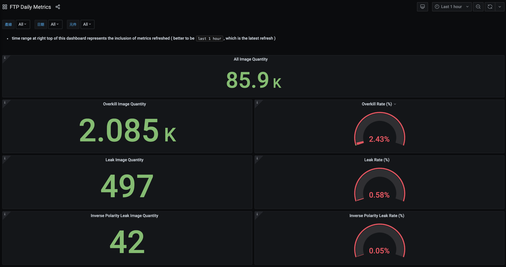
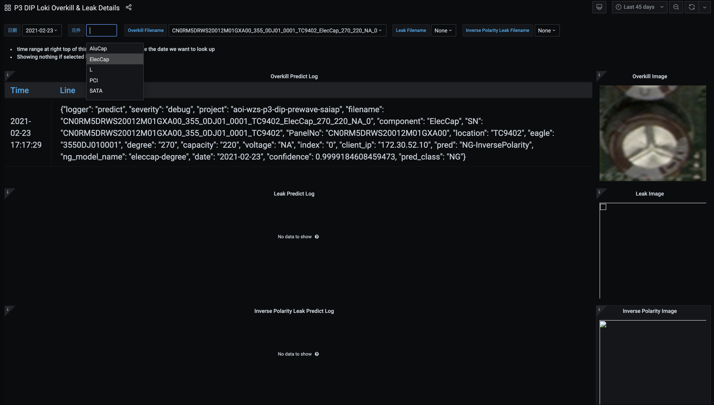
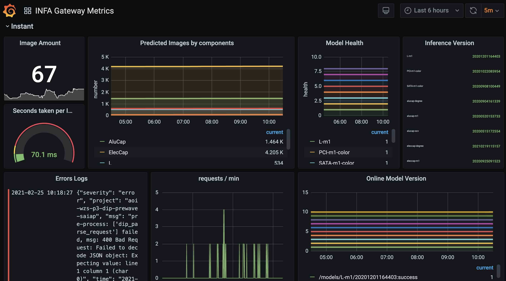
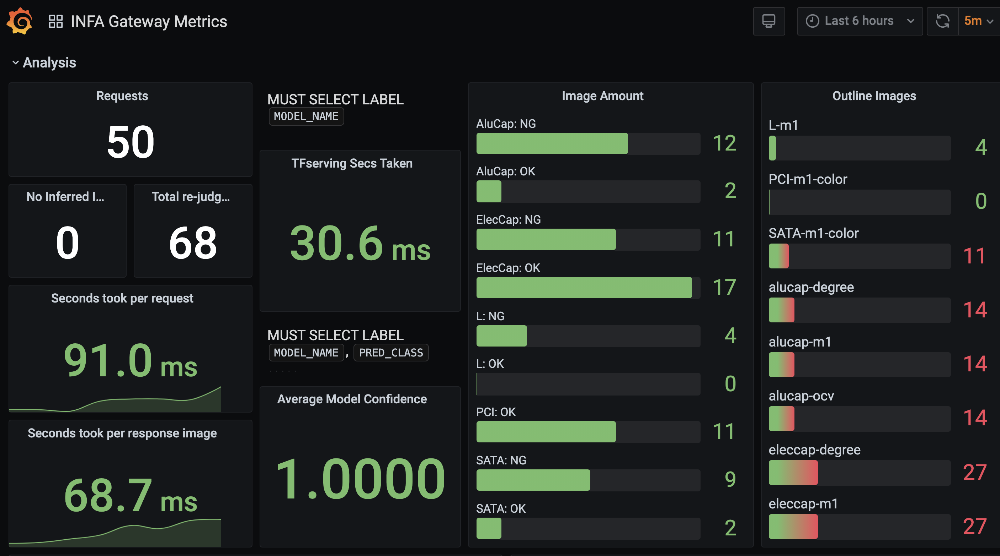
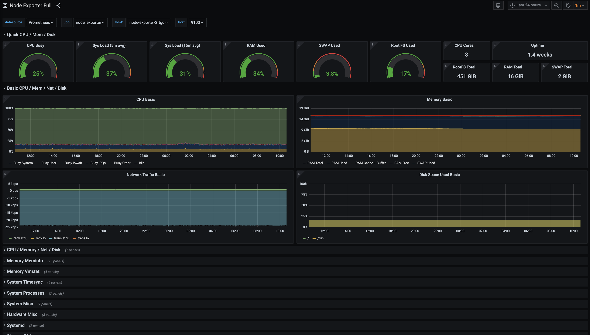

# all kubernetes deployment yaml
- with kustomization for better customization
- with kustomization for deploying multi services in a command
---
|Service|Purpose|Details|
|-|-|-|
| [daily-metrics](./base/daily-metrics) | real-time online model performance collection  | parsing labeled images amount by component into prometheus format and calculating overkill & leak rate |
| [gateway](./base/gateway) | distributor dealing with images to be inferred |  |
| [grafana](./base/grafana) | visualization of all kinds of data  | mainly data from loki and prometheus visualized in this repo |
| [loki](./base/loki) | data from promtail collection | labeling log for better searching |
| [node-exporter](./base/node-exporter) | server status | all kinds of server status in prometheus format |
| [prometheus](./base/prometheus) | data with timestamp collection | easier to show data change by time with counter & gauge |
| [promtail](./base/promtail) | log collection |  |
| [storage](./base/storage) | pvc auto setup by local path provisioner |  |
| [tensorflow serving](./base/tfserving) | tensorflow servable models deployment |  |
| [gitlab-runner](./dev/gitlab-runner) | gitlab cicd runner setup |  |
| [image-dataset-db](./dev/image-dataset-db) | mongodb for all collected images |  |
| [jupyter](./dev/jupyter) | tensorflow 2 jupyter setup |  |
| [pull-ftp](./dev/pull-ftp) | downloading ftp data & inserting to db periodly |  |
# monitoring visualization
`daily-metrics`

`gateway`

`node-exporter`
